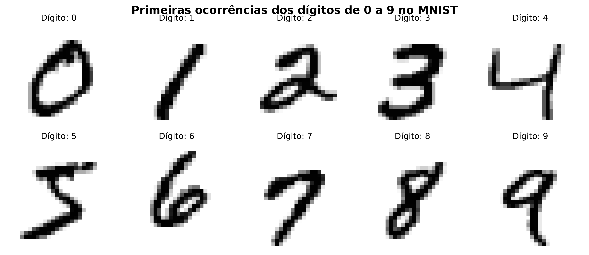
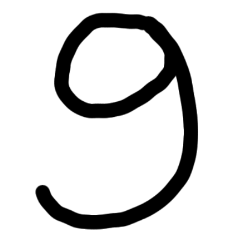
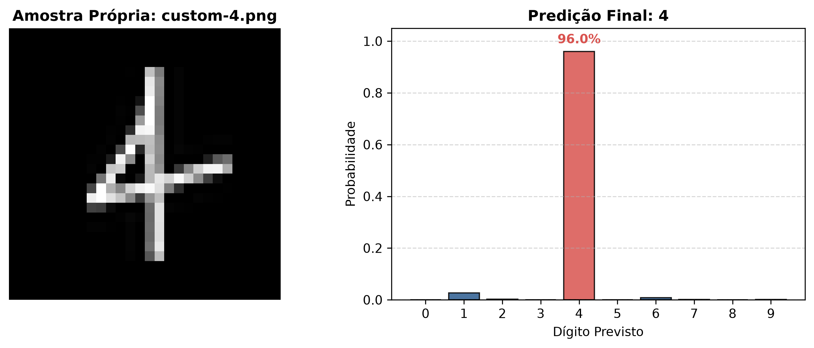
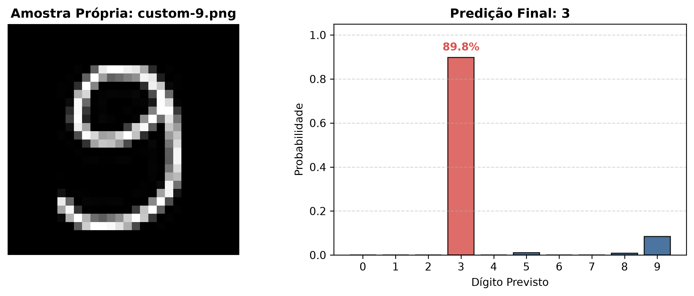

# Cernere - Reconhecimento de Dígitos Manuscritos

Projeto de visão computacional com o desenvolvimento, comparação e avaliação de algoritmos de aprendizado de máquina e rede neural no reconhecimento de dígitos manuscritos (MNIST). Projeto desenvolvido para o curso Desenvolvimento de IA para Análise Preditiva do programa SCTEC.

O nome dado a este projeto é a palavra "cernere" (pronuncia-se "quérnere") do latim, que significa "discernir"/"distinguir".

O Cernere inclui etapas de pré-processamento, treinamento de modelos, avaliação de desempenho, experimentos com classes ocultadas e teste de generalização, e ainda inferência com imagens manuscritas próprias.

## 📊 O Dataset e pré-processamento

*Dataset:* MNIST (Modified National Institute of Standards and Technology database), obtido da biblioteca `sklearn.datasets`.
- Dimensões do input: Imagens em escala de cinza de $28 \times 28$ pixels, aplanadas em vetores contínuos de $784$ colunas/features.
- Escalamento: O projeto realiza uma normalização dos valores numéricos dos pixels do intervalo bruto $[0, 255]$ para o intervalo $[0.0, 1.0]$.
- Amostragem: $70.000$ amostras rotuladas divididas em conjuntos de treino, validação e teste, na proporção 70-10-20.



## 🛠️ Bibliotecas e Dependências:

- Python 3.12.10 (O TensorFlow não funciona com uma versão superior)
- Pandas 3.0.5
- Numpy 2.5.3
- Matplotlib 3.11.1
- Seaborn 0.13.2
- Scikit-learn 1.9.0
- XGBoost 3.4.1
- TensorFlow 2.21.0
- Keras 3.15.1
- Keras-tuner 1.4.8

- Foi utilizado um ambiente virtual para uso controlado das dependências do projeto.

## 🚀 Como executar o projeto:
1. Clone este repositório em sua máquina local.
2. Crie um ambiente virtual e ative-o.
3. Instale as dependências do projeto utilizando o arquivo requirements.txt.
4. Execute o notebook cernere.ipynb para treinar, avaliar e experimentar sobre os modelos preditivos.

## 📁 Estrutura de Pastas:

O projeto foi desenvolvido de maneira modularizada, com a seguinte estrutura de pastas:

```
├── data
│   ├── custom
│   ├── raw
├── notebooks
│   ├── cernere.ipynb
├── outputs
│   ├── images
│   ├── models
├── src
│   ├── config.py
│   ├── dataset.py
│   ├── evaluation.py
│   ├── models.py
│   ├── ood.py
│   ├── plots.py
│   ├── preprocessing.py
```

## 🔬 Etapas deste projeto:

* **Fase 1: Exploração e análise:** Visualização de amostras do dataset MNIST e análise da distribuição de classes.

* **Fase 2: Pré-processamento dos dados:** Normalização dos pixels `[0.0, 1.0]` e divisão estratificada em conjuntos de treino, validação e teste.

* **Fase 3: Otimização e treinamento dos modelos:**
  * **KNN:** Busca de hiperparâmetros via *Grid Search*.
  * **XGBoost:** Otimização via *Random Search*.
  * **Rede Neural (MLP):** Otimização de arquitetura e hiperparâmetros via *Keras Tuner*.

* **Fase 4: Avaliação dos modelos:** Comparação de métricas de desempenho, matrizes de confusão e relatórios de classificação no conjunto de teste.

* **Fase 5.1: Treinamento restrito com classes ocultadas (Class Masking):** Remoção intencional das classes `4` e `9` durante o treinamento da rede neural.

* **Fase 5.2: Teste de Generalização Extrema (Inferência OOD):** Avaliação do comportamento e do nível de confiança da MLP treinada sem os dígitos `4` e `9` para experimentar sua capacidade de generalização a dados fora da distribuição.

* **Fase 5.3: Inferência com imagens manuscritas próprias:** Pré-processamento customizado (detalhado mais abaixo) para o formato esperado pelo modelo e inferência com dígitos escritos à mão via pen tablet.

## 📝 Resultados da inferência com imagens manuscritas próprias:

Foi feito um teste de inferência com imagens manuscritas próprias, utilizando o melhor modelo treinado (MLP). Escrevi digitalmente os numerais 4 e 9 em imagens PNG com fundo branco e 400 pixels de largura e altura.

<p align="center">
  
  
</p>

As imagens foram processadas e normalizadas para o formato esperado pelo modelo conforme o seguinte pipeline:

- Conversão em escala de cinza ;
- Inversão caso o fundo seja claro;
- Recorte da imagem em um quadrado de 20x20;
- Centralização da imagem num quadrado de 28x28 (mantendo um padding ao redor do desenho do numeral);
- Normalização dos valores numéricos de cor dos pixels do intervalo `[0, 255]` para o intervalo continuo `[0.0, 1.0]`;
- Alinhamento pelo Centro de Massa: deslocamento (*shift*) espacial dos eixos da matriz usando a biblioteca `scipy.ndimage` para alinhar o centro de gravidade do traço ao centro geométrico da imagem (`14.0, 14.0`);
- Estruturação em Tabela (DataFrame): conversão da matriz processada final em um formato bidimensional `28x28` para inspeção tabular dos pixels.

No notebook essa tabela passa por um achatamento (`1x784`) para enfim ser submetida à predição pela rede neural.




As inferências do modelo MLP nas amostras customizadas parecem refletir o impacto direto do estilo de escrita na distribuição de probabilidades

Dígito 4: Acertou com confiança de 97,3%. A grafia em estilo "barco à vela" (com topo fechado, linhas retas e intersecção proeminente) tem uma assinatura geométrica marcante que preveniu a confusão clássica do MNIST entre 4 e 9 (comum em traços com topo aberto), garantindo alta certeza preditiva.

Dígito 9: Errou com confiança de 89,8%. A curvatura da cabeça e da haste geraram uma sobreposição parcial no espaço de características com o dígito 3, exemplificando um dos tipos de erro encontrados no treinamento do modelo. A probabilidade de 8,36% de que a imagem do 9 fosse realmente um 9 indica que o modelo ainda reconheceu parcialmente as características do numeral, mas não o suficiente para uma predição correta.

## 🌐 Idioma do código:

- Nomes de funções em inglês;
- Nomes de variáveis em inglês;
- Nomes de arquivos em inglês;
- Nomes de branches em inglês;
- Mensagens de commit em inglês;
- Comentários em português;
- Docstrings em português;
- Discussão e explicações no notebook em português.

A ideia aqui foi deixar o código em si acessível para a comunidade desenvolvedora, mas com comentários e explicações voltados para o contexto avaliativo do SCTEC.


## 🎬 Vídeo sobre o projeto

[Vídeo]()
<sub>*Dica: Segure Ctrl / Cmd ao clicar para abrir o vídeo em uma nova aba.*</sub>